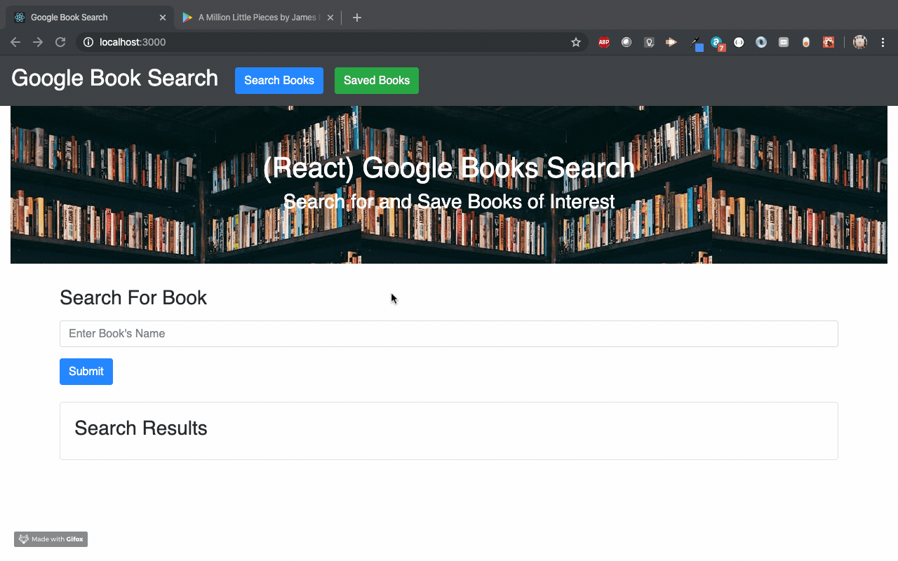

# google-book-search (MERN-app)

Google book search app utilizes React lifecycle methods to query and display books based on user searches. The app also uses Node, Express and MongoDB for the user to save books to review or purchase later.

# Tools/Technologies Used

* Javascript
* React
* JSX
* Express
* Node.js
* MongoDB/Mongoose

# Preview
